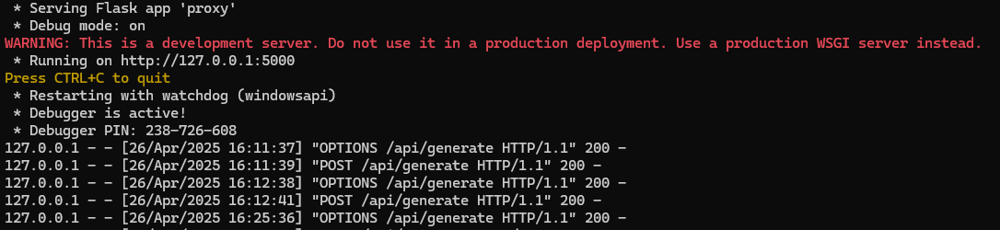

# Offline Markdown Notepad with Summarizer

**Markdown Notepad**, a lightweight **offline-first** note-taking Chrome Extension that allows you to write notes in Markdown and instantly generate **AI-powered summaries** — **without any internet connection**.


---

## Key Features

-  **Markdown Support**: Write notes with basic Markdown formatting (bold, italic, headers, lists).
-  **Instant Summarization**: Summarize your notes using a local **gemma3:1b-it-qat LLM** (downloaded from Ollama).
-  **Fully Offline**:  No internet required. Data never leaves your machine.
-  **Save Notes**: One-click export as `.md` files.


---

## Architecture Overview


---

##  Prerequisites

Make sure you have installed:

- **Python 3.x**
- **Chrome Browser**
- **flask**
- **[Ollama](https://ollama.com/)** installed locally (for running LLM models)
- **Desired LLM** model downloaded via Ollama

---

## Steps to Set Up

### 1. Clone This Repository

```bash
git clone https://github.com/your-username/markdown-notepad.git
cd markdown-notepad
```


### 2. Install Python Dependencies

```bash
pip install flask flask-cors requests
```

These libraries are required to run the local Flask proxy server.

### 3. Start the Flask Proxy Server

Inside your project folder, run:

```bash
python proxy_server.py
```

You should see:

```plaintext
* Running on http://127.0.0.1:5000/ 
* Press CTRL+C to quit
```


 Your proxy server is now ready and listening on port 5000.

### 4. Start Ollama Server and Load Gamma 1B Model

In a separate terminal window:

```bash
ollama serve
```

or directly run:

```bash
ollama run gamma:1b
```

 This ensures that the LLM is ready to accept summarization requests.

### 5. Load Extension in Chrome Browser

- Open Chrome and visit: `chrome://extensions/`

- Enable Developer Mode (top right corner).

- Click **Load Unpacked**.

- Select the folder where you cloned this repo (`markdown-notepad/`).

- Your extension should now appear on the Chrome Extensions page.

### 6. Use The Extension

- Click on the extension icon.

- Start typing your notes in Markdown format.

- Click "Generate Summary" to summarize the notes instantly, even offline!

